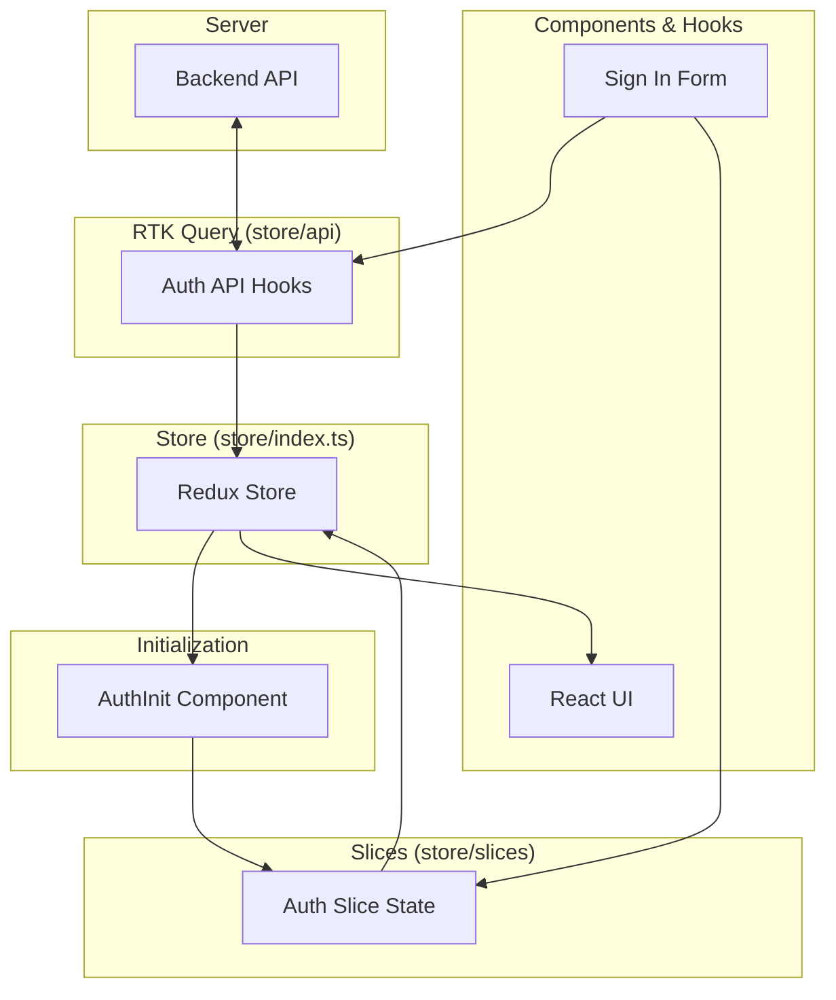

# RTK Flow: From API to Components

This document explains how Redux Toolkit (RTK) and RTK Query are structured in `admin.orchestra.com`, following the data flow from the backend API to the UI components.

## Architecture Overview

The Redux setup is divided into three main parts:
1.  **RTK Query (API Layer)**: Handles data fetching, caching, and server state.
2.  **Slices (UI State Layer)**: Handles global UI state that isn't directly managed by RTK Query (e.g., current user, auth status).
3.  **Hooks & Components**: Consumer layer that triggers actions and reads state.

---

## 1. The API Layer (RTK Query)
**File:** `admin.orchestra.com/store/api/authApi.ts`

RTK Query is used for all server interactions. It automatically generates React hooks (prefixed with `use`) for each endpoint.

-   **`createApi`**: Defines the base URL and endpoints.
-   **Endpoints**:
    -   `login`: A **mutation** (POST) that sends credentials.
    -   `getMe`: A **query** (GET) that fetches current user info.
-   **Tags**: Used for cache invalidation. When `login` happens, it invalidates `User` tags, prompting queries like `getMe` to re-fetch if needed.

## 2. The UI State Layer (Slices)
**File:** `admin.orchestra.com/store/slices/authSlice.ts`

While RTK Query manages server data, we often need a separate slice to track "App State" (like "Is the user currently logged in?").

-   **`initialState`**: Defines properties like `user`, `isAuthenticated`, and `isInitialized`.
-   **`reducers`**: Synchronous actions like `setCredentials` or `logout` that update the state immediately.
-   **`selectors`**: Helper functions (e.g., `selectCurrentUser`) to read specific parts of the state.

## 3. The Store Configuration
**File:** `admin.orchestra.com/store/index.ts`

The store is the "Brain" that connects everything.

-   It combines the `authApi.reducer` and `authReducer`.
-   It adds **middleware** required by RTK Query for caching and invalidation.
-   It exports `RootState` and `AppDispatch` types for TypeScript support.

## 4. Initialization (The "Session Check")
**File:** `admin.orchestra.com/components/AuthInit.tsx`

When you refresh the page, the Redux state is wiped. We need to check if the user is still logged in (via cookies/session).

1.  `AuthInit` calls `useGetMeQuery()`.
2.  RTK Query hits `/auth/me`.
3.  If successful, `AuthInit` dispatches the `initialize` action to `authSlice` to restore the user session in the UI state.

## 5. Usage in Hooks & Components
**Example:** `admin.orchestra.com/hooks/useSignInForm.ts`

This is where everything comes together:

1.  **Trigger Mutation**: Calls `const [login] = useLoginMutation()`.
2.  **Wait for Response**: `await login(formData).unwrap()`.
3.  **Update Global State**: If login succeeds, it dispatches `dispatch(setCredentials({ user }))`.
4.  **Read State**: Uses `useSelector(selectAuthError)` to show errors if the mutation fails.

---

## Summary Flow
1.  **Component** calls a hook (from `authApi`).
2.  **RTK Query** sends the HTTP request and handles the loading state.
3.  **Component** receives the data and **Dispatches** a slice action (from `authSlice`).
4.  **Slice** updates the global state.
5.  **Selectors** broadcast the new state to all listening components.
